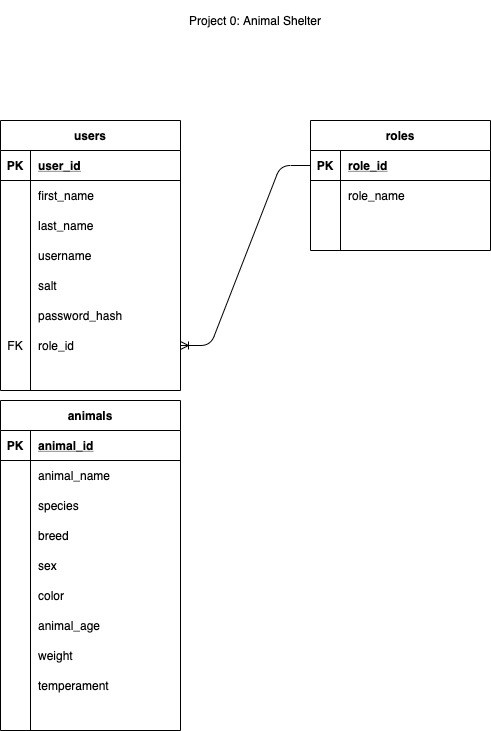

# Fur Haven Animal Shelter

Web Service / API to keep track of animals in a (NO KILL!!) shelter.

## Features

<ul>
    <li>Manage users (create, update, delete)</li>
    <li>Set roles for users (user, admin)</li>
    <li>View users (all, by ID, by username, by last name)</li>
    <li>Login / Logout</li>
    <li>Manage animals (create, update, delete)</li>
    <li>View animals (all, by ID, by species, by breed, by male/female)</li>
</ul>

## API Resources / URI's

All results are returned in JSON format.

### Users
### `<GET>` /animalshelter/users/

Response: Returns all users.

### `<GET>` /animalshelter/users?{userid, username, or lastname}={search value}

Example: /animalshelter/users?username=acapp

Response: Returns first user that matches {search value}.

### `<GET>` /animalshelter/user/{id}/

Response: Returns the user matching the user id {id}.

### `<POST>` /animalshelter/user/

Action: Inserts new user in database.

<ul>Constraints:
<li>Body of request must contain valid JSON</li>
<li>Body must contain a unique username (no duplicate usernames allowed).</li>
<li>Body must contain a role. If not 'admin' (any case) then will be assigned 'user'</li> 
</ul>
Response: Returns the created user if request was successful.

### `<PUT>` /animalshelter/user/{id}/

Need to complete

### `<DELETE>` /animalshelter/user/{id}/

Need to complete

Add routes for animals...

## Database Schema

## Installation

Written with Ruby version 2.6.3p62 using Ruby on Rails Framework.

Uses a Sqlite3 database.  To refresh or set up the database, use the following steps:

    $ rails db:drop

    $ rails db:migrate

    $ rails db:seed

Download the code for this webapp using:

    $ git clone https://github.com/ACAPP-dev/auto-dealer.git

Update Gem files using command:

    $ bundle install 
    
    or
    
    $ bundle update

## Development

    You can use:
    
    $ rails s
            
    to start webserver.
    
    Use:

    $ rails c

    to enter a console session for debugging and/or exploring.

## Contributing

Bug reports and pull requests are welcome on GitHub at https://github.com/ACAPP-dev/auto-dealer. This project is intended to be a safe, welcoming space for collaboration, and contributors are expected to adhere to the [Contributor Covenant](http://contributor-covenant.org) code of conduct.

Written by **Andrew Capp** in conjunction with _Flatiron Academy_ - April 2020

## License

The gem is available as open source under the terms of the [MIT License](https://opensource.org/licenses/MIT).

## Code of Conduct

Everyone interacting in the project’s codebases, issue trackers, chat rooms and mailing lists is expected to follow the [code of conduct](https://github.com/ACAPP-dev/auto-dealer/blob/master/CODE_OF_CONDUCT.md).